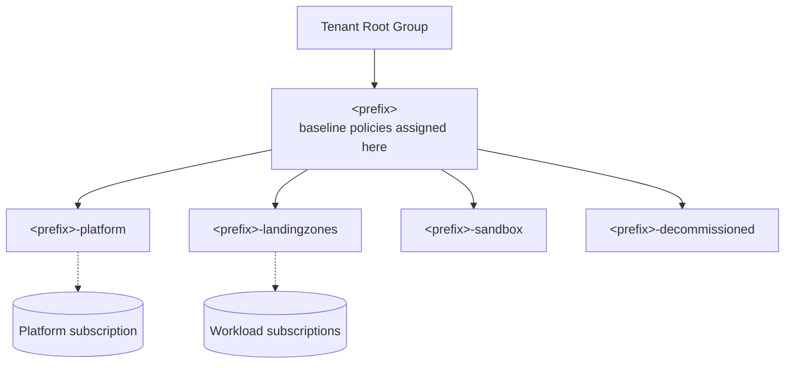
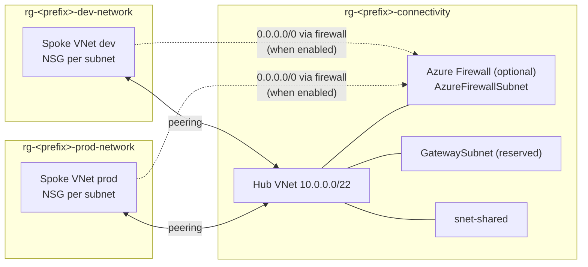

# Architecture

The starter deploys a deliberately small landing zone for SMBs: one
management group hierarchy, one platform subscription that hosts shared
services, and any number of spoke networks for workloads. Terraform
(`terraform/`) and Bicep (`bicep/`) produce the same result.

## Management groups and policy

Policies assigned at the intermediate root (`<prefix>`) are inherited by every
child management group and subscription:

| Assignment | Built-in definition (GUID) | Effect |
|---|---|---|
| `allowed-locations` | Allowed locations (`e56962a6-4747-49cd-b67b-bf8b01975c4c`) | Deny |
| `allowed-locations-rg` | Allowed locations for resource groups (`e765b5de-1225-4ba3-bd56-1ac6695af988`) | Deny |
| `req-rg-tag-<tag>` | Require a tag on resource groups (`96670d01-0a4d-4649-9c89-2d3abc0a5025`) | Deny |
| `inh-tag-<tag>` | Inherit a tag from the resource group if missing (`ea3f2387-9b95-492a-a190-fcdc54f7b070`) | Modify (managed identity + Contributor) |
| `sec-storage-https` | Secure transfer to storage accounts should be enabled (`404c3081-a854-4457-ae30-26a93ef643f9`) | Audit |
| `sec-storage-public` | Storage account public access should be disallowed (`4fa4b6c0-31ca-4c0d-b10d-24b96f62a751`) | Audit |
| `sec-app-https` | App Service apps should only be accessible over HTTPS (`a4af4a39-4135-47fb-b175-47fbdf85311d`) | Audit |
| `sec-kv-softdelete` | Key vaults should have soft delete enabled (`1e66c121-a66a-4b1f-9b83-0fd99bf0fc2d`) | Audit |
| `sec-vm-mdisks` | Audit VMs that do not use managed disks (`06a78e20-9358-41c9-923c-fb736d382a4d`) | Audit |
| `mcsb-audit` (optional) | Microsoft cloud security benchmark initiative (`1f3afdf9-d0c9-4c3d-847f-89da613e70a8`) | Audit |

Setting `policy_enforcement = false` (Terraform) or `policyEnforcement = false`
(Bicep) assigns everything in `DoNotEnforce` mode so you can review compliance
before anything is blocked.

## Networking

- Every subnet (except the Azure-reserved ones) gets its own empty NSG, ready
  for workload rules.
- With the firewall enabled, each spoke gets a route table that sends
  `0.0.0.0/0` to the firewall's private IP. The firewall policy starts with
  threat intelligence in **Deny** mode, DNS proxy on and **no allow rules**:
  add rule collection groups for the traffic you need.
- Spoke-to-spoke traffic is not transitive through peering; route it via the
  firewall if required.

## Logging, security and cost

```mermaid
flowchart LR
    AL["Subscription Activity Log"] --> LAW["Log Analytics workspace<br/>rg-&lt;prefix&gt;-management"]
    AFWL["Firewall logs"] --> LAW
    MDC["Defender for Cloud<br/>plans + security contact"] --> LAW
    BUD["Monthly budget<br/>50/80/100% actual, 100% forecast"] --> MAIL["Email alerts"]
```

- One PerGB2018 workspace with configurable retention and an optional daily cap.
- Defender for Cloud plans are configurable per resource type and default to
  **Free** (foundational CSPM). Switch individual plans to `Standard` when you
  are ready to pay for workload protection.
- A subscription budget sends email at 50, 80 and 100 % of actual spend and at
  100 % of forecast spend.
- The `tags` input is applied to every resource; the tag policies make sure
  new resource groups carry the same cost-allocation tags.
